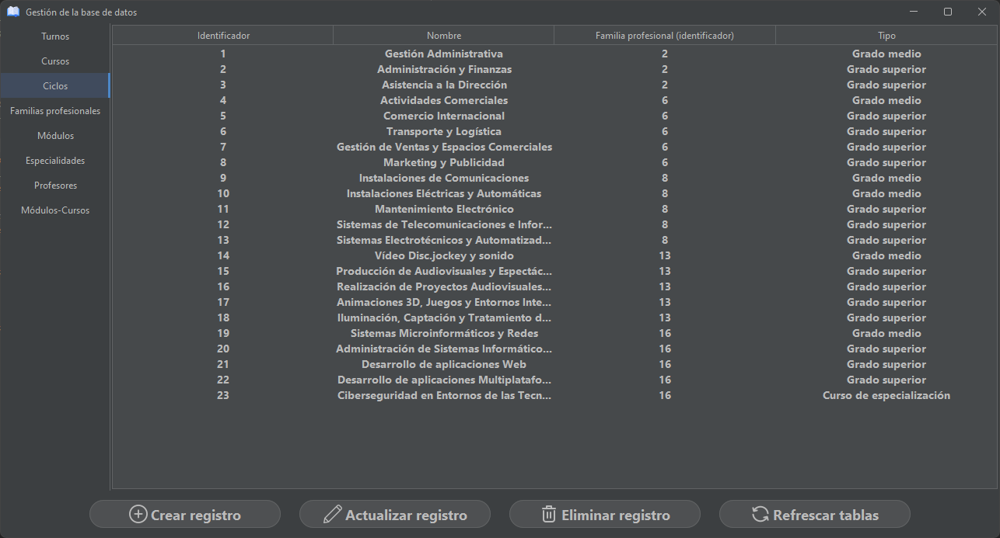
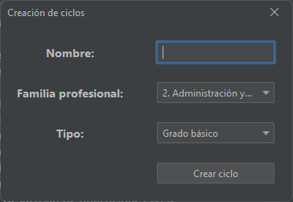
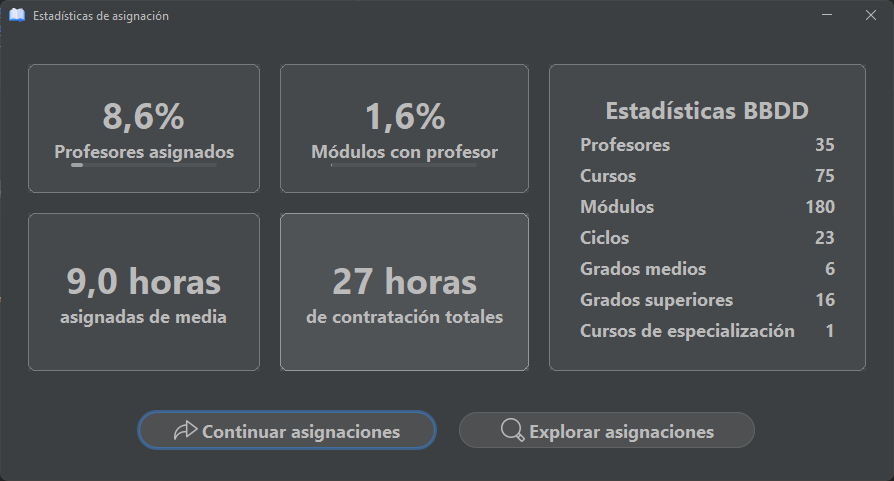
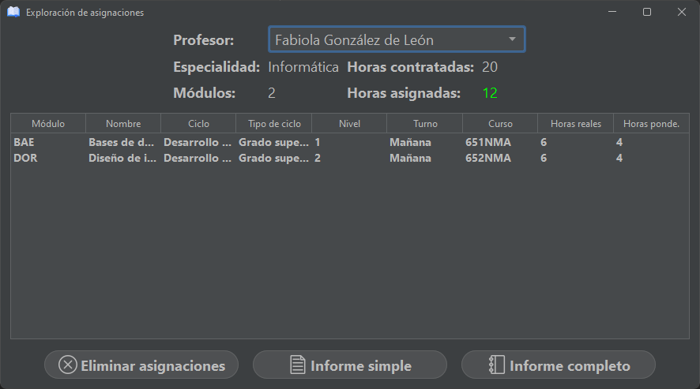
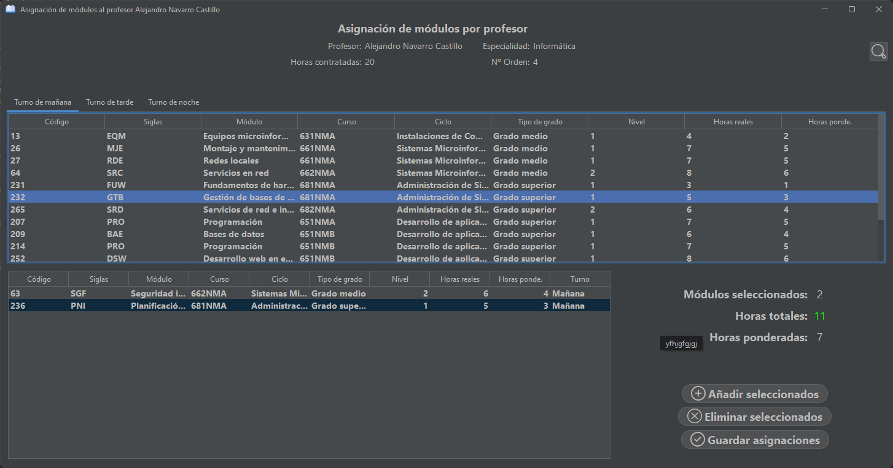

# Module Assignments

Module Assignments is an app that allows teachers to create module assignments for studies. It uses Java Swing and SQL.

> [!NOTE]  
> This app was made when I was a student and had a tight deadline, so don't expect quality code. 

# Images

